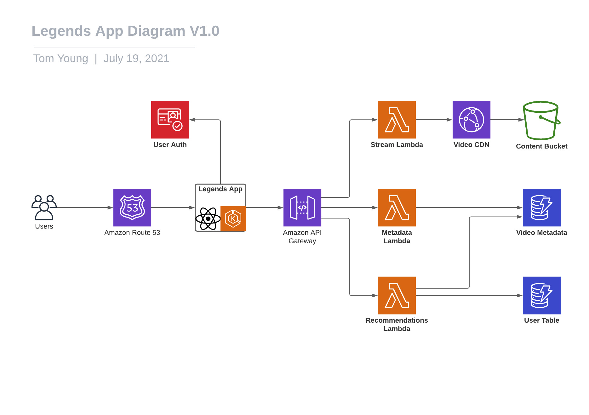

# Legends App Solution

This document details the proposed architecture for the Legends App

## Overview

The solution consists of a React app with which users can:
* Login securely based on pre-provided credentials
* Browse available videos
* Have relevant videos recommended to them
* Set sport preferences
* Stream videos of sports events

## Diagram 

## Components and Services

### Legends App

#### Overview

* **Technology:** React, Typescript
* **Description:** EKS containerised React application to allow users to browse and stream video
* **Dependencies:** 
    * Cognito User Auth
    * Metadata Lambda
    * Recommendations Lambda
    * Stream Lambda
    * Route 53 Routing
* **Responsibilities:**
    * Handle auth and login of end users
    * Allow search and browsing of sports videos
    * Allow setting of sports preferences
    * Collect search and streaming data
    * Allow streaming of sports videos
* **Security**: Initially, users will be given logins to allow them to sign in using Cognito

#### Operation

* **Target Platform:** AWS
* **Resiliency:** EKS can be hosted across availability zones to allow spin up of new clusters / instances quickly
* **Scalability:** EKS can manage adding more resources using an ASG so that we can scale on demand. In the case of anticipated travel spikes, we can raise the minimum resources in the ASGs

#### Costs

* EKS cluster costs $0.10/h ~= $73/mo
* EC2 cost will vary depending on usage but e.g.:
  * 4 x t4g.medium instances cost: $27.45/mo
  * data out to internet (should just be pages as assets will be on CDN). Assume 50000 page loads of 1mb per month gives 50GB x $0.09 = $4.50/mo

### Cognito User Auth

#### Overview

User auth service provided by cognito
* User pools created manually at first
* Login requests authenticated against user pool
* Access token returned to call API gateway

#### Operation

* **Resiliency:** Multiple AZs and automatic failover
* **Scalability:** Initial default quotas for category operations should be ample for this use case

#### Monitoring

Cloudwatch will be used to monitor operations against quotas

#### Costs

Assuming 50000 Users initially it will be free. If we go up to e.g. 1million users the cost would be: $4415 / mo

### Content Bucket

#### Overview

This S3 bucket will store the converted, streamable video files and their manifests

#### Operation

* **Resiliency:** Multiple AZs and automatic failover
* **Scalability:** S3 will scale automatically to meet demand, CloudFront should limit the amount of requests for the same file

#### Monitoring

* Use Cloudwatch for request and storage volume metrics
* Use server access logging to keep track of who is accessing the bucket

#### Costs

Read costs should be waived as they will be streamed through CloudFront. Storage costs considered in the video-processing docs.

### API Gateway

#### Overview

An API Gateway will be used to handle requests to the Metadata Lambda, Reccommendation Lambda and Stream Lambda
* Authentication using the JWT tokens returned by Cognito

#### Operation

* **Resiliency:** Multiple AZs and automatic failover
* **Scalability:** API Gateway will autoscale to meet demand

#### Monitoring

* Use Cloudwatch to monitor metrics and logs

#### Costs

Assume 50000 monthly users make average of 600 monthly calls each to API gateway = 30 million calls. cost is $105 / mo

### Stream Lambda

#### Overview

* **Technology:** Serverless, Typescript
* **Description:** Tyescript lambda for constructing CDN urls for the Legends App to stream from
* **Dependencies:** 
    * Content Bucket
    * Cognito User Auth
* **Responsibilities:**
    * Take hashed value of video file as parameter
    * Return a CDN url to stream the requested video from S3 via CloudFront
* **Endpoints:**
    * GET /[videohash] - will return a CDN url for the requested video hash (In future we will take resolution as a query parameter)     
* **Security**: Use the JWT token returned by Cognito when the curator logs into the Upload App

#### Operation

* **Resiliency:** Multiple AZs and automatic failover
* **Scalability:** We can set an appropriate concurrency limit, within which Lambda will scale automatically

#### Monitoring

* Use Cloudwatch to monitor metrics and logs

#### Costs

First 1 million requests are free, $0.02 per million then on. The lambda should be fairly fast as it's just generating a url. Assuming 1 million monthly calls at 100ms with 128Mb memory, cost is $0.23 / mo 

### Metadata Lambda

#### Overview

* **Technology:** Serverless, Typescript
* **Description:** Tyescript lambda for saving / retrieving video metadata
* **Dependencies:** 
    * Video Metadata Table
    * Cognito User Auth
* **Responsibilities:**
    * Receive POST requests with video metadata
    * Perform any required data sanitisation
    * Save metadata to DynamoDB
    * Retrieve metadata for a given video hash
    * Retrieve videos matching search parameters
    * Retrieve videos according to recommendations
* **Endpoints:**
    * GET /[videohash] - will return the metadata associated with a particular video
    * GET /search - will search the DynamoDB table for relevant results, query parameters will be used to build up the search: 
      * title
      * sport
      * year
      * duration
      * tags
      * dateadded
    * POST - will create and save POSTed video metadata
    * PATCH /view/[videohash] - increments the views count for a given video  
* **Security**: Use the JWT token returned by Cognito when the curator logs into the Upload App

#### Operation

* **Resiliency:** Multiple AZs and automatic failover
* **Scalability:** We can set an appropriate concurrency limit, within which Lambda will scale automatically

#### Monitoring

* Use Cloudwatch to monitor metrics and logs

#### Costs

First 1 million requests are free, $0.02 per million then on. Most of the lambda's endpoints should be fairly fast as it's only doing basic data manipulation and saving to / retrieving a DynamoDB table. The search endpoint will have more overhead. Assume 512Mb of memory needed.
* /[videohash] POST and /view endpoints assumed to take about 200ms to process and receive a total of 20 million calls. Cost is $33.60 / mo
* /search assumed to take up to 2000ms and receive ~5 million calls. Cost is $83.10 / mo

### Recommendation Lambda

#### Overview

* **Technology:** Serverless, Typescript
* **Description:** Tyescript lambda for saving / retrieving data around user recommendations
* **Dependencies:** 
    * Video Metadata Table
    * Users Table
    * Cognito User Auth
* **Responsibilities:**
    * Receive data showing which videos are viewed by which user
    * Update User Data table with user activity data
    * Query User data and Metadata Lambda to return suggested videos
* **Endpoints:**
    * GET /[userid] - will return recommendations for a given user
    * PATCH /view/[videohash]/[userid] - adds this video hash to a user's watch history in the Users Table
    * POST /[userid] - will allow the user to set sports preferences   
* **Security**: Use the JWT token returned by Cognito when the curator logs into the Upload App

#### Operation

* **Resiliency:** Multiple AZs and automatic failover
* **Scalability:** We can set an appropriate concurrency limit, within which Lambda will scale automatically

#### Monitoring

* Use Cloudwatch to monitor metrics and logs

#### Costs

First 1 million requests are free, $0.02 per million then on. Assume 512Mb of Memory needed.
* GET endpoint assume ~5 million calls at 1000ms. Cost is $41.60 / mo
* PATCH endpoint assume ~1 million calls at 200ms. Cost is $1.68 / mo
* POST endpoint assume 50000 calls at 100ms. Cost is negligible

### Video Metadata Table

#### Overview

This table will hold our video metadata for use in our Legends App
* Primary Key: Video Hash (same as the filename in S3)
* Sort Key: year
* Potential Secondary Indexes:
    * **Partition:** sport, **Sort:** year
    * **Partition:** sport, **Sort:** duration
    * **Partition:** sport, **Sort:** streamcount
    * **Partition:** videohash, **Sort:** streamcount
    * **Partition:** year, **Sort:** stream
    * **Partition:** videohash, **Sort:** rendition

#### Operation

* **Resiliency:** Multiple AZs and automatic failover
* **Scalability:** DynamoDB will autoscale to meet demand

#### Monitoring

* Use Cloudwatch to monitor metrics and logs

#### Costs

Read and patch costs (initial write and storage costs detailed in ../video-upload/README.md): 
* 1st million write units: $1.4846/mo 
* ~20 million read requests in a month. Cost is $5.94 / mo

### User Table

#### Overview

This table will hold User data for use in our Legends App
* Primary Key: UserId
* Potential Secondary Indexes:
    * **Partition:** UserId, **Sort:** videohash - this could be used to store and search viewed videos for a given user
    * **Partition:** UserId, **Sort:** isAccount - this can be used to get only the users account and preference data

#### Operation

* **Resiliency:** Multiple AZs and automatic failover
* **Scalability:** DynamoDB will autoscale to meet demand

#### Monitoring

* Use Cloudwatch to monitor metrics and logs

#### Costs

* 50000 initial users created + ~1 million writes for video views. Cost ~$1.50 / mo 
* ~10 million combined read requests for user preferences and watch history. Cost ~$3.00 / mo

### Video CDN

#### Overview

This CloudFront distribution will handle asset streaming for our Legends App, primarily for video streaming.

#### Operation

* **Resiliency:** Multiple AZs and automatic failover and high availability
* **Scalability:** Cloudfront will autoscale to meet demand

#### Monitoring

* Use Cloudwatch to monitor metrics and logs

#### Costs

Assume 1 million video streams in a month of ~5Gb each. Cost is $39050 / mo if we stream full video each time. In practice this is likely to be much lower as most users probably won't watch the whole video.