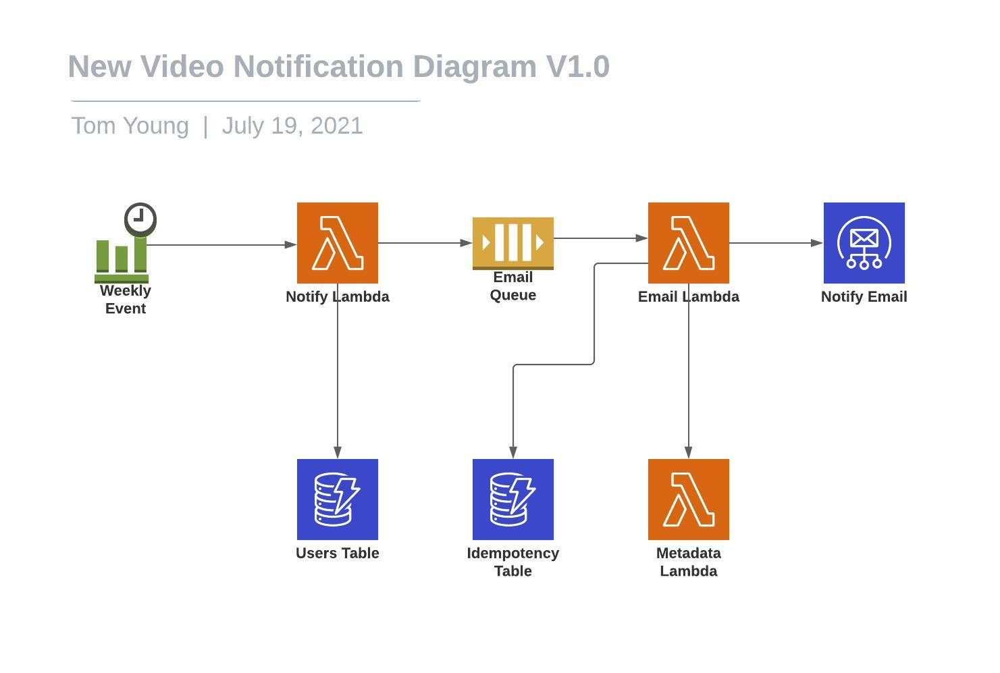

# Video Notification Solution

This document details the proposed method of notifying registered users of new videos

## Overview

This solution will scan the Video Metadata Table once per week for videos added in the last week, build an email template and send a request to SES to notify customers

## Diagram 

## Components and Services

### Notify Lambda

#### Overview

* **Technology:** Serverless, Typescript
* **Description:** Tyescript lambda to build a list of email addressees and add them to an SQS queue
* **Dependencies:** 
    * Weekly Event
    * Email Queue
    * Users Table
* **Responsibilities:**
    * Triggerd by a Timed CloudWatch Event
    * Gets list of registered users
    * Puts users onto the Email Queue, with each message containing a batch of 50 users
* **Security**: Only allow to be triggered by the CloudWatch Event

#### Operation

* **Resiliency:** Multiple AZs and automatic failover
* **Scalability:** We can set an appropriate concurrency limit, within which Lambda will scale automatically

#### Monitoring

* Use Cloudwatch to monitor metrics and logs

#### Costs

Retrieving all ~50000 users from DynamoDb, splitting that into 1000 SQS messages with 50 users each, then sending them 10 at a time to SQS gives us 100 SQS calls. Assuming that the DynamoDb retrieval takes ~30seconds, each SQS call takes 100ms, and that we need 1024Mb of memory to handle the large data volume. Cost is still negligible at 4 times a month.

### Email Lambda

#### Overview

* **Technology:** Serverless, Typescript
* **Description:** Tyescript lambda for creating an SES email batch request with a template
* **Dependencies:** 
    * Email Queue
    * Idempotency Table
    * Metadata Lambda
    * Notify Email
* **Responsibilities:**
    * Pulls batches of email addresses from the Notify Email Queue
    * Checks Idempotency table to ensure no duplicate sends
    * Retrieves Video Metadata for videos uploaded in the last week
    * Builds email template request and sends it to SES
* **Security**: Only allow to be triggered by the Email Queue

#### Operation

* **Resiliency:** Multiple AZs and automatic failover
* **Scalability:** We can set an appropriate concurrency limit, within which Lambda will scale automatically

#### Monitoring

* Use Cloudwatch to monitor metrics and logs

#### Costs

If there are 50000 users this will be invoked 4000 times a month (1000 x batch of 50 users x 4 weeks in month). It should run in around 1000ms with 512Mb of memory. Cost should be negligible.

### Idempotency Table

#### Overview

A Table that will temporarily store SQS message ID and content hash to ensure no duplicate messages are processed

#### Operation

* **Resiliency:** Multiple AZs and automatic failover
* **Scalability:** Will scale capacity automatically

#### Costs

Should be very low cost for the volumes we're using

### Email Queue

#### Overview

An SQS Queue to hold batches of email addresses for processing by our Email Lambda

#### Operation

* **Resiliency:** Multiple AZs and automatic failover
* **Scalability:** SQS will automatically scale

#### Costs

We will be well within the 1 million requests free tier.

### Weekly Event

#### Overview

A CloudWatch cron job that will trigger at a given time every week

#### Operation

* **Resiliency:** Multiple AZs and automatic failover
* **Scalability:** Only happens once a week so will not need to scale

#### Costs

For once weekly we will be well within the free tier.

### Notify Email

#### Overview

SES will accept batch send requests with given templates containing video data

#### Operation

* **Resiliency:** Multiple AZs and automatic failover
* **Scalability:** SES scales automatically

#### Costs

50000 users receive 4 emails per month. Cost is $20 / mo