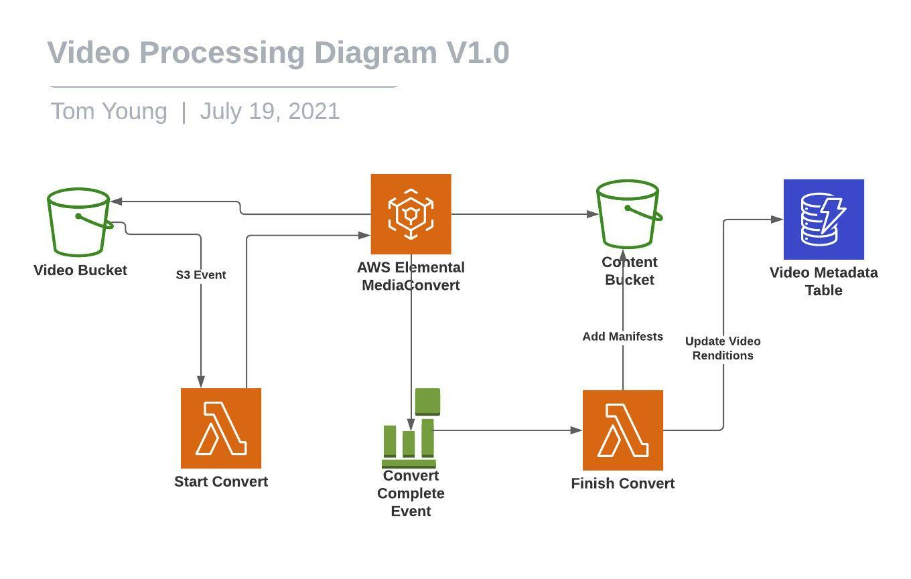

# Video Processing Solution

This document details the proposed method of converting video to streamable formats and notifying users of new videos via email

## Overview

This solution uses Amazon MediaConvert to take new videos from the Video Bucket, convert them and store the streamable formats along with manifests in the Stream bucket.

## Diagram 

## Components and Services

### Video Bucket

Discussed in more detail in the legends-app and video-upload docs. Only addition here is that we enable triggering of the Start Convert Lambda from an S3 event.

### Content Bucket

#### Overview

This S3 bucket will store the converted streamable video files, along with their manifests and will be used to stream videos via Cloudfront to our Legends App (discussed in the legends-app README.md).

#### Operation

* **Resiliency:** Multiple AZs and automatic failover
* **Scalability:** S3 will scale automatically to meet demand, but for this we anticipate low volumnes

#### Monitoring

* Use Cloudwatch for request and storage volume metrics
* Use server access logging to keep track of who is accessing the bucket

#### Costs

Assuming 5TB of video (accounting for ~1000 90 min HD videos at ~5GB each), cost would be $122.89 for storage. Streaming costs will be discussed in the legends-app README.md)

### Start Convert Lambda

#### Overview

* **Technology:** Serverless, Typescript
* **Description:** Tyescript lambda for building and submitting jobs to MediaConvert
* **Dependencies:** 
    * Video Bucket
    * AWS MediaConvert
* **Responsibilities:**
    * Triggered by S3 put events
    * Creates and submits job for conversion by MediaConvert
* **Security**: Can only be triggered by events from the Video Bucket

#### Operation

* **Resiliency:** Multiple AZs and automatic failover
* **Scalability:** We can set an appropriate concurrency limit, within which Lambda will scale automatically

#### Monitoring

* Use Cloudwatch to monitor metrics and logs

#### Costs

For an estimate of 1000 videos we will be well within the free tier.

### Finish Convert Lambda

#### Overview

* **Technology:** Serverless, Typescript
* **Description:** Tyescript lambda for doing post video conversion tasks
* **Dependencies:** 
    * CloudWatch Events
    * Content Bucket
    * Video Metadata Table
* **Responsibilities:**
    * Triggerd by cloudwatch notification when MediaConvert job is finished
    * Save the streaming manifests into the content bucket
    * Update the Video Metadata Table by adding the renditions to the video item, including resolution information and CDN url.
* **Security**: Only allow to be triggered by the CloudWatch Event 

#### Operation

* **Resiliency:** Multiple AZs and automatic failover
* **Scalability:** We can set an appropriate concurrency limit, within which Lambda will scale automatically

#### Monitoring

* Use Cloudwatch to monitor metrics and logs

#### Costs

For an estimate of 1000 videos we will be well within the free tier.

### Convert Complete Cloudwatch

#### Overview

CloudWatch event stream triggered by MediaConvert on job completion, triggers the Finish Convert Lambda

#### Operation

* **Resiliency:** Multiple AZs and automatic failover
* **Scalability:** Cloudwatch will scale automatically

#### Monitoring

* Use Cloudwatch to monitor metrics

#### Costs

For an estimate of 1000 videos we will be well within the free tier.

### AWS Elemental MediaConvert

#### Overview

MediaConvert will be used to convert our origin video into a streamable HLS format with manifest to ensure efficient and smooth streaming for our users.

#### Operation

* **Resiliency:** Multiple AZs and automatic failover
* **Scalability:** We can reserve a Conversion Unit and otherwise MediaConvert will scale to meet demand

#### Monitoring

* Use Cloudwatch to monitor metrics

#### Costs

For an estimate of 1000 videos at 90 mins converting into HD AVC with HLS, cost is $1530 

### Video Metadata Table

Discussed in more detail in the legends-app and video-upload docs

