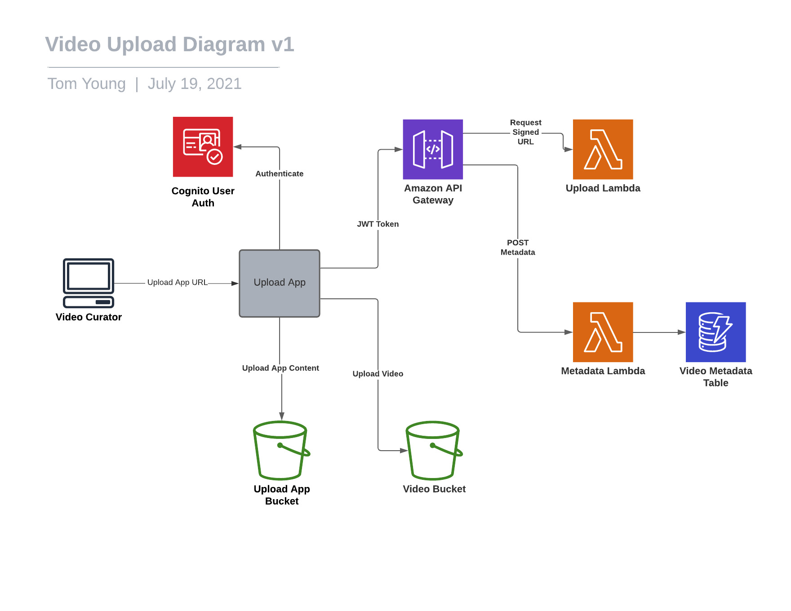

# Video Upload Solution

This document details the proposed solution for uploading sports videos with metadata. N.B. Subsequent processing is detailed in the video-processing README.md

## Overview

The solution consists of a web application that can be used by video curators to upload video for use in our Legends App. 
The app will:
* Restrict access to authenticated users only, using a login page
* Allow the user to enter metadata and validate it
* Upload a video file from their computer

## Diagram 

## Components and Services

### Upload App

#### Overview

* **Technology:** HTML, CSS, Javascript
* **Description:** S3 Served static website providing a form for video upload
* **Dependencies:** 
    * Upload App Bucket
    * Video Bucket
    * Cognito User Auth
    * Upload Lambda
    * Metadata Lambda
* **Responsibilities:**
    * Handle auth and login of video curators
    * Provide form for input and validation of video metadata
    * Hash the video file and request a signed url to upload it to S3
    * Upload video file to S3 using signed url
    * Save metadata
* **Security**: Curators will be given logins to allow them to sign in using Cognito

#### Operation

* **Target Platform:** AWS
* **Resiliency:** S3 hosted in multiple AZs for resiliency
* **Scalability:** S3 will scale automatically, but in any case this is unlikely to be high request volume

#### Costs

Development costs should be low as this will be a fairly simple static website. Running costs will be covered in sections on the dependent services.

### Cognito User Auth

#### Overview

User auth service provided by cognito
* User pools created manually at first
* Login requests authenticated against user pool
* Access token returned to call API gateway

#### Operation

* **Resiliency:** Multiple AZs and automatic failover
* **Scalability:** Initial default quotas for category operations should be ample for this use case

#### Monitoring

Cloudwatch will be used to monitor operations against quotas

#### Costs

Up to 50000 users are free in Cognito, which should amply cover us for this admin app.

### Upload App Bucket

#### Overview

Publicly accessible S3 bucket which will contain and serve our built Upload App.
* At first we can just provide our curators with the S3 bucket's url
* In future we may want to host the domain properly on Route 53

#### Operation

* **Resiliency:** Multiple AZs and automatic failover
* **Scalability:** S3 will scale automatically to meet demand, but for this we anticipate low volumnes

#### Monitoring

Simple Cloudwatch monitoring of requests and storage should be sufficient

#### Costs

Assuming a static website size of >1GB and a request volume of ~10000/mo, the cost would be $0.03/mo

### Video Bucket

#### Overview

This S3 bucket will store the uploaded video files before conversion.
* Only allow getting/putting objects using signed urls

#### Operation

* **Resiliency:** Multiple AZs and automatic failover
* **Scalability:** S3 will scale automatically to meet demand, but for this we anticipate low volumnes

#### Monitoring

* Use Cloudwatch for request and storage volume metrics
* Use server access logging to keep track of who is accessing the bucket

#### Costs

Assuming 5TB of video (accounting for ~1000 90 min HD videos at ~5GB each), cost would be $122.89 for storage. Streaming costs will be discussed in the legends-app README.md). In future we could consider moving original video files into Glacier after conversion is complete.

### API Gateway

#### Overview

An API Gateway will be used to handle requests to the Upload Lambda and Metadata Lambda
* Authentication using the JWT tokens returned by Cognito

#### Operation

* **Resiliency:** Multiple AZs and automatic failover
* **Scalability:** API Gateway will autoscale to meet demand

#### Monitoring

* Use Cloudwatch to monitor metrics and logs

#### Costs

We would likely be within the free tier of 1 million requests per month for this operation.

### Upload Lambda

#### Overview

* **Technology:** Serverless, Typescript
* **Description:** Tyescript lambda for creating pre-signed urls to be used to upload to the Video Bucket
* **Dependencies:** 
    * Video Bucket
    * Cognito User Auth
* **Responsibilities:**
    * Take hashed value of video file as parameter
    * Check if a file with the same hash exists in S3 - return 400 if so
    * Return a pre-signed url to upload a file with the name of the hash
* **Security**: Use the JWT token returned by Cognito when the curator logs into the Upload App

#### Operation

* **Resiliency:** Multiple AZs and automatic failover
* **Scalability:** We can set an appropriate concurrency limit, within which Lambda will scale automatically

#### Monitoring

* Use Cloudwatch to monitor metrics and logs

#### Costs

First 1 million requests are free, $0.02 per million then on. The lambda should be fairly fast as it's just generating a url.

### Metadata Lambda

#### Overview

* **Technology:** Serverless, Typescript
* **Description:** Tyescript lambda for saving video metadata
* **Dependencies:** 
    * Video Metadata Table
    * Cognito User Auth
* **Responsibilities:**
    * Receive POST request with video metadata
    * Perform any required data sanitisation
    * Save metadata to DynamoDB
* **Security**: Use the JWT token returned by Cognito when the curator logs into the Upload App

#### Operation

* **Resiliency:** Multiple AZs and automatic failover
* **Scalability:** We can set an appropriate concurrency limit, within which Lambda will scale automatically

#### Monitoring

* Use Cloudwatch to monitor metrics and logs

#### Costs

First 1 million requests are free, $0.02 per million then on. The lambda should be fairly fast as it's only doing basic data manipulation and saving to a DynamoDB table.

### Video Metadata Table

#### Overview

This table will hold our video metadata for use in our Legends App
* Primary Key: Video Hash (same as the filename in S3)
* Sort Key: year
* Potential Secondary Indexes:
    * **Partition:** sport, **Sort:** year
    * **Partition:** sport, **Sort:** duration

#### Operation

* **Resiliency:** Multiple AZs and automatic failover
* **Scalability:** DynamoDB will autoscale to meet demand

#### Monitoring

* Use Cloudwatch to monitor metrics and logs

#### Costs

Write and storage costs: 
* 1st million write units: $1.4846/mo 
* storage should be within 25GB free tier.
* Backup cost assuming table size of ~1GB (~1000 very big JSON files, likely this will be less) $0.23772/mo
(reading costs considered in legends-app README)

